


# astril: Automated Segmentation Toolkit for Radiology Image Libraries
### Authors:
- Alexander Ling (alexander.l.ling@gmail.com; alling@bwh.harvard.edu)
-  E. Antonio Chiocca
### License: Creative Commons CC BY-NC-SA 4.0
### License Holders:
- Alexander Ling
- E. Antonio Chiocca
- Mass General Brigham
### Installation Requirements:
- Python 3.11 or higher
### Description:
astril is a python package designed to streamline radiology image pre-processing (i.e. scan type identification, DICOM to NIFTI conversion, co-registration, skull stripping, normalization, etc.), segmentation, and model training. The package was built to make it easy for other researchers to trivially apply our glioblastoma segmentation algorithms to their own brain MRI scans while also providing the tools to refine our models or train their own from scratch. Most of the functions in this package should also work with radiology images other than MRIs, though the functionality and models are currently tailred specifically to MRI images.

A detailed description of the package and instructions for its use will be provided in the coming months as we finalize the package and its associated manuscript.

### General Workflow (rough draft)
---
#### Format for radiology image inputs:
astril is designed to perform image pre-processing and segmentation on NIFTI (.nii.gz) images. However, astril includes functionality to convert DICOM imaging datasets to NIFTI images and organize them into the folder structure expected by astril's processing functions.
If starting from a set of DICOM images, they should be organized by patient, exam, radiology type, and sequence as in the following example:
```
DICOM_Library/
├── Patient1/ 					{Patient}
│   ├── Exam1/ 				    {Exam}
|	|	├── MR/ 			    {Radiology Type}
|	|	|	├── T1n/ 			{Sequence}
|	|	|	|	├── 001.dcm
|	|	|	|	├── 002.dcm
|	|	|	|	├── ...
|	|	|	├── T1c/
|	|	|	|	├── 145.dcm
|	|	|	|	├── 146.dcm
|	|	|	|	├── ...
|	|	|	├── ...
|	|	├── ...
|	├── Exam2/
|	|	├── MR/ 
|	|	|	├── T1n/
|	|	|	|	├── 001.dcm
|	|	|	|	├── 002.dcm
|	|	|	|	├── ...
|	|	|	├── ...
|	|	├── ...
│   ├── ...
├── ...
```
If starting from a set of NIFTI images, they should be organized by patient, exam, and sequence as in the following example:
```
NIFTI_Library/
├── Patient1/ 					{Patient}
|   ├── Exam1/ 				    {Exam}
|	|	├── T1n.nii.gz 			{Sequence}
|	|	├── T1c.nii.gz 
|	|	├── ...			
|   ├── ...
├── ...
```
---
#### Convert DICOM library to NIFTI library
1. (Optional) Ensure that all of the DICOM files for each series are properly separated into their respective directories. I have occasionally found that DICOM libraries can have misplaced dicom files such that a single series has been divided into multiple folders or such that dicom files from multiple series have been placed in the same folder. The following command will check that all dicom files are correctly separated. **Note: The .dcm files in your library must have meaningful SeriesInstanceUID or SeriesNumber, SeriesDescription, and ProtocolName metadata fields for this to work. If these fields have been stripped, this function will not work as intended and could scramble your library if used with the --in_place option.**
    ```
    usage: python -m astril.preprocess demix_dicoms [-h] --dir DIR [--outDir OUTDIR] [--logOut LOGOUT] [--n_workers N_WORKERS] [--dryRun] [--in_place] [--noProgress]

    options:
      -h, --help            show this help message and exit
      --dir DIR             Root directory containing patient/exam/MR folders with DICOM (.dcm) files.
      --outDir OUTDIR       Write a fully de-mixed COPY of --dir under this path
      --logOut LOGOUT       Optional path for move log (.csv|.tsv)
      --n_workers N_WORKERS
                            Threads for header reads/transfers (I/O bound)
      --dryRun              Plan demix and write log, but do not move/copy files
      --in_place            Allow in-place moves inside --dir (no --outDir)
      --noProgress          Disable progress bar
    ```
2. Create a spreadsheet of patient-level metadata to help with organizing/deidentifying your dataset during NIFTI file conversion. A template patient metadata spreadsheet can be generated using the following function.
    ```
    usage: python -m astril.preprocess create_patient_metadata [-h] --dir DIR --metadataOut METADATAOUT [--previousMetadata [PREVIOUSMETADATA ...]] [--omitPrevious] [--subdirs SUBDIRS [SUBDIRS ...]]
                                                               [--excludeEmpty] [--n_workers N_WORKERS]

    options:
      -h, --help            show this help message and exit
      --dir DIR             Root directory with {Patient}/.../MR/{series}
      --metadataOut METADATAOUT
                            Output table (.csv|.tsv|.xlsx)
      --previousMetadata [PREVIOUSMETADATA ...]
                            Zero or more prior tables to prefill from
      --omitPrevious        Omit rows already present in previous tables
      --subdirs SUBDIRS [SUBDIRS ...]
                            Subfolder names to search under each patient folder
      --excludeEmpty        Drop patient folders with no DICOM series found
      --n_workers N_WORKERS
                            Threads for scanning (I/O bound). Set 1 to disable.
    ```
    This will generate a metadata table with the following columns:
    - **Directory:** The immediate subdirectory of --dir to which the metadata in a given row pertains. Remember, each of these directories should contain scans for only a single patient.
    - **patientID:** An arbitrary identifier that you will assign to this patient. This is the identifier that will be used when DICOM files are converted to NIFTI files.
    - **patientName:** The name of the patient as extracted from the DICOM metadata.
    - **dicomPatientID:** The patientID for this patient as extracted from the DICOM metadata.
    - **day0Date:** A date (mm/dd/yyyy) that should be used as day 0 when organizing scans by timepoint.

    <u>Example of an Incomplete Table</u>
    |Directory|patientID|patientName|dicomPatientID|day0Date|
     |-|-|-|-|-|
     |Patient1| |Jane Doe|1234567||
     |Patient2| |John Doe|7654321||

    <u>Example of a Completed Table</u>
    |Directory|patientID|patientName|dicomPatientID|day0Date|
     |-|-|-|-|-|
     |Patient1|Subject1|Jane Doe|1234567|01/21/1900|
     |Patient2|Subject2|John Doe|7654321|01/22/1900|

     Note: If you load the patient metadata table into Excel to edit it, **do not** permit excel to perform data conversion. Data conversion could remove leading 0's on directory names that start with 0, causing the directories listed in the table to no longer match the actual directory names.

 3. Create a DICOM to NIFTI conversion plan by identifying DICOM series types and identifying where the converted scans will be stored and how they will be named.
     ```
     usage: python -m astril.preprocess plan_dicom_to_nifti_conversion [-h] --patientMetadata PATIENTMETADATA --dir DIR --outDir OUTDIR --planOut PLANOUT [--n_workers N_WORKERS] [--noProgress]
                                                                      [--previousPlan [PREVIOUSPLAN ...]] [--ignorePrevious] [--mrSubdirs [MRSUBDIRS ...]] [--minSlices MINSLICES] [--use_actual_exam_ids]

    options:
      -h, --help            show this help message and exit
      --patientMetadata PATIENTMETADATA
                            Table from create_patient_metadata() (filled in)
      --dir DIR             Root DICOM directory; must contain subfolders in 'Directory' column
      --outDir OUTDIR       Planned destination root for converted files
      --planOut PLANOUT     Where to write the plan (.csv|.tsv|.xlsx). .csv|.tsv files will be streamed; .xlsx files will only write after function is complete.
      --n_workers N_WORKERS
                            Threads per exam (I/O bound)
      --noProgress          Disable progress bar
      --previousPlan [PREVIOUSPLAN ...]
                            0+ previous plan files to reuse/skip exam directories from.
      --ignorePrevious      Skip exams already present in previous plan files (instead of reusing their rows).
      --mrSubdirs [MRSUBDIRS ...]
                            Only include these MR subfolder names (case-insensitive).
      --minSlices MINSLICES
                            Minimum slices required to consider a sequence for selection.
      --use_actual_exam_ids
                            Use the terminal ExamDirectory folder name as ExamAlias (may contain PHI) instead of a random 8-char alias.
    ```
    This will generate a table which lists all of the scan series present in --dir along with the patient, timepoint, and inferred scan type (i.e. T1c, T1n, etc.) assocaited with them. After this file has been created, you can manually inspect and edit it to ensure that all desired series will be converted and correctly named in the next step. The columns relevant to conversion in the next step are:
    -selected_for_conversion
    -proposed_nifti_path

    All scans selected for conversion with a valid proposed_nifti_path will be converted to that path. The proposed file names are constructed to follow the format `{outDir}/{patientID}/{patientID}_{timepoint_days}_{ExamAlias}/{patientID}_{timepoint_days}_{final_label}.nii.gz`. This is the format astril will expect NIFTI libraries to be in for downstream segmentation/algorithm training.

4. Convert DICOM image library to a NIFTI image library.
    ```
    usage: python -m astril.preprocess convert_dicom_plan [-h] --plan PLAN [--n_workers N_WORKERS] [--overwrite] [--no_reorient] [--no_compress] [--logOut LOGOUT]

    options:
      -h, --help            show this help message and exit
      --plan PLAN           Path to plan CSV/TSV/XLSX from plan_dicom_to_nifti_conversion.
      --n_workers N_WORKERS
                            Parallel workers (I/O-bound).
      --overwrite           Overwrite existing output NIfTI if present.
      --no_reorient         Disable reorientation to standard space.
      --no_compress         Write .nii instead of .nii.gz.
      --logOut LOGOUT       Optional CSV/TSV/XLSX log path for results.
    ```

    This will use the conversion plan created in the last step to actually convert the files to a NIFTI library.